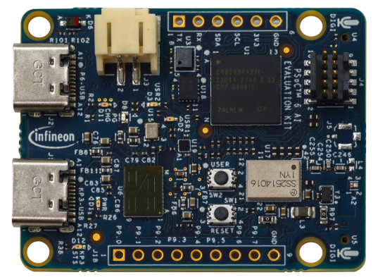
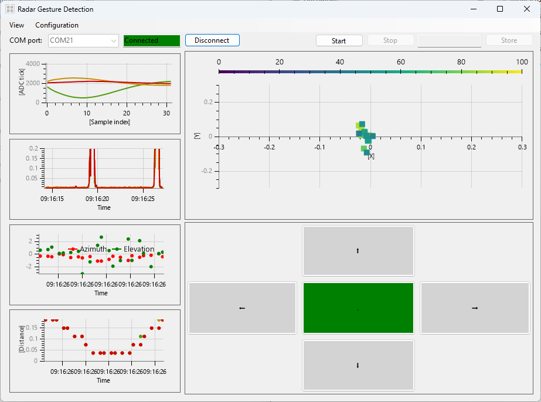

# CY8CKIT-062S2-AI - Gesture using radar

This project is intended to help you to start with gesture detection using the BGT60TR13C.

The project streams data from the radar sensor through USB to a Windows C# GUI.

The GUI collects the raw data, apply for signal processing on it (see application note) and displays it on the screen.

## Requirements

- [ModusToolbox&trade;](https://www.infineon.com/modustoolbox) v3.6 or later (tested with v3.6)
- Board support package (BSP) minimum required version: 1.0.0
- Programming language C
- Programming language C#
- [CY8CKIT-062S2-AI](https://www.rutronik24.fr/produit/infineon/cy8ckit062s2ai/24290171.html)

## Supported kits (make variable 'TARGET')

- [CY8CKIT-062S2-AI](https://www.infineon.com/evaluation-board/CY8CKIT-062S2-AI)

## Hardware setup

This project uses the board's default configuration.

## Operation

1. Import the project into Modus Toolbox, and build it.

2. Connect the board to your PC using the provided USB cable through the KitProg3 USB connector (Programming port).

3. Open a terminal program and select the KitProg3 COM port. Set the serial port parameters to 8N1 and 115200 baud

4. After programming, the application starts automatically

5. Connect the board to your PC usingthe "Data port" and start the Windows GUI.

## Legal Disclaimer

The evaluation board including the software is for testing purposes only and, because it has limited functions and limited resilience, is not suitable for permanent use under real conditions. If the evaluation board is nevertheless used under real conditions, this is done at one’s responsibility; any liability of Rutronik is insofar excluded. 

